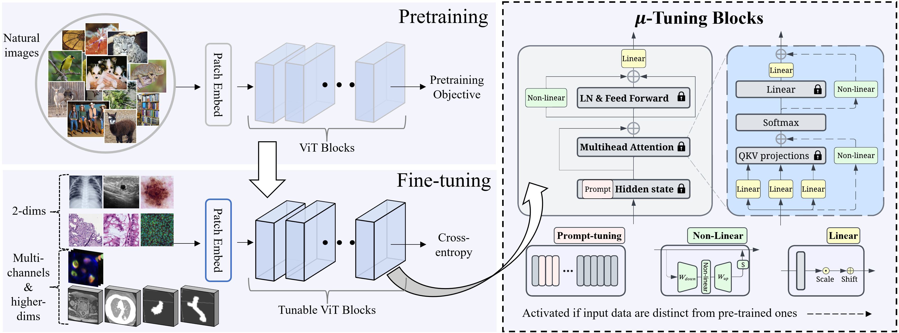

## μ-Tuning - Optimizing Your Foundation Model for Medical Images: A Comprehensive Analysis of Fine-Tuning Strategies

PAPER IS AVAILABLE [HERE](https://github.com/tsly123/mutuning/blob/main/assets/mu_tuning.pdf)

 Overview of the pipeline

## Usage

### Environment
1. Clone this repository by `git clone https://github.com/tsly123/mutuning.git`
2. Install an [Anaconda](https://www.anaconda.com/products/distribution) distribution of Python. Note you might need to use an anaconda prompt if you did not add anaconda to the path.
3. Open an anaconda prompt / command prompt which has `conda` for **python 3** in the path
4. Go to downloaded `assets` folder inside the downloaded folder at step 1 and run `conda env create -f mutuning_env.yml`
5. To activate this new environment, run `conda activate mutuning`

### DATA Preparation

1. 2D data were download at the source of each dataset
2. Download 3D data at[https://medmnist.com/](https://medmnist.com/)

### Fine-tuning 2D
Go to the folder `mu_2D` and run:

`bash scripts/mvlpt/main_single_coopdata_cut.sh $trainer $config $num_token $shots $seed $lr $eval_bool $dataset $save_dir`

### Fine-tuning 3D and higher-D
Go to the folder `mu_3D` and run:

`bash scripts/mvlpt/main_single_coopdata_cut.sh $trainer $config $num_token $shots $seed $lr $eval_bool $dataset $save_dir`

`$trainer` - such as VPT, bias, SSF, ... are defined in file `scripts\mvlpt\main_single_coopdata_cut.sh` and `trainers`

### TODO

- [x] Upload running
- [ ] Upload clean code
- [ ] Update fine-tuning instruction

